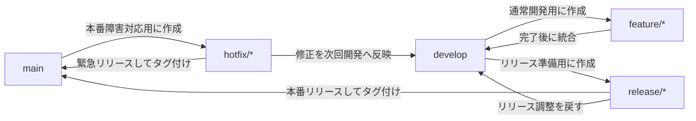
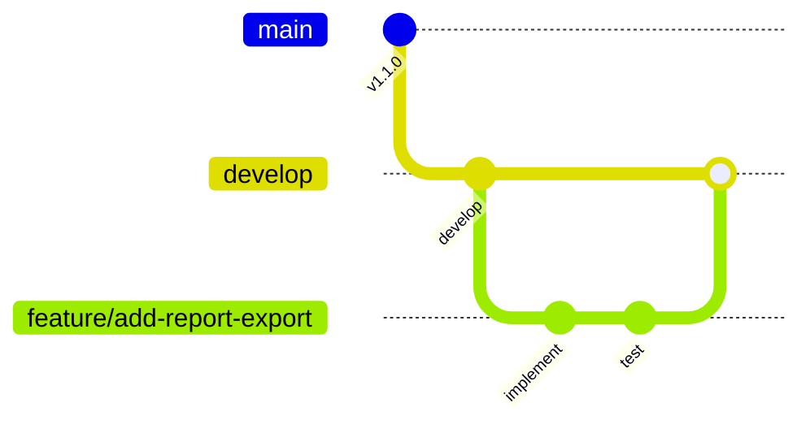
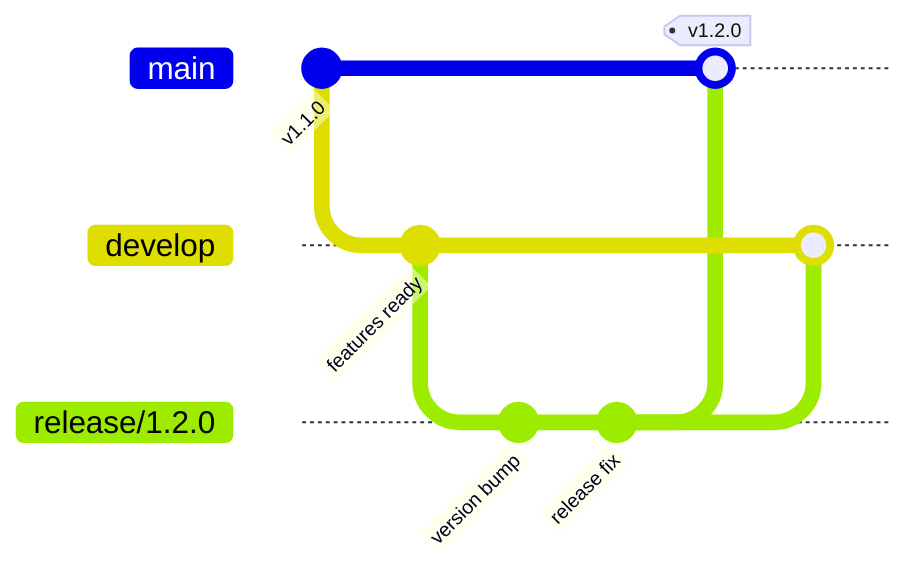
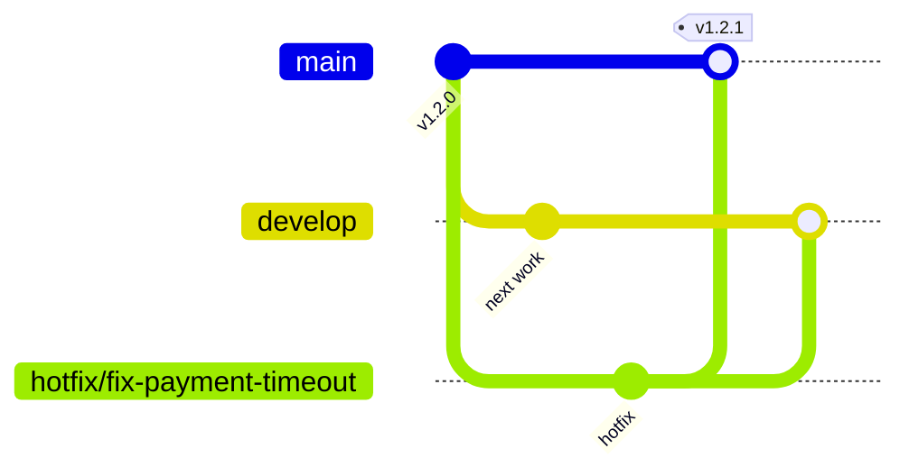

# Gitflow ガイド

この文書は、Gitflow を採用する場合のブランチ構成、作業フロー、運用ルールをまとめる。

Gitflow は、リリース作業が明確に分かれているプロジェクトや、複数バージョンを並行して保守するプロジェクトに向いている。一方で、継続的デリバリーを重視する小規模プロジェクトでは運用が重くなる場合がある。

## Gitflow の全体像



主な流れ:

- `feature/*` は `develop` から作成し、完了後に `develop` へ戻す
- `release/*` は `develop` から作成し、完了後に `main` と `develop` へ戻す
- `hotfix/*` は `main` から作成し、完了後に `main` と `develop` へ戻す
- リリースタグは `main` 上のリリースコミットに付ける

## 1. 基本方針

- `main` は本番リリース済みの状態を表す
- `develop` は次回リリースに向けた統合ブランチとする
- 日常開発は `feature/*` で行う
- リリース準備は `release/*` で行う
- 本番障害や緊急修正は `hotfix/*` で行う
- ブランチをマージする前に、差分、テスト、コミット単位を確認する

## 2. ブランチ構成

### 2.1 main

`main` は本番リリース済みの履歴を管理するブランチ。

運用ルール:

- 直接コミットしない
- リリース完了時に `release/*` または `hotfix/*` からマージする
- リリースタグを付与する
- 常にリリース可能な状態を保つ

例:

```bash
git switch main
git merge --no-ff release/1.2.0
git tag v1.2.0
git push origin main --tags
```

### 2.2 develop

`develop` は次回リリースに向けた統合ブランチ。

運用ルール:

- `feature/*` の取り込み先にする
- 次回リリース候補が揃ったら `release/*` を作成する
- `main` に入った `hotfix/*` の変更も取り込む

例:

```bash
git switch develop
git pull --ff-only
```

### 2.3 feature/*

`feature/*` は機能追加や通常の修正を行う作業ブランチ。

作成元:

- `develop`

マージ先:

- `develop`

例:

```bash
git switch develop
git pull --ff-only
git switch -c feature/add-user-search
```

完了時:

```bash
git switch develop
git pull --ff-only
git merge --no-ff feature/add-user-search
git branch -d feature/add-user-search
```

推奨:

- 1 ブランチ 1 目的にする
- PR を作る場合も `develop` 向けに作成する
- コミット単位は `COMMIT_UNIT_GUIDE.md` に従う

### 2.4 release/*

`release/*` はリリース準備用ブランチ。

作成元:

- `develop`

マージ先:

- `main`
- `develop`

用途:

- バージョン番号の更新
- リリースノート更新
- 軽微なバグ修正
- リリース前の最終確認

作成例:

```bash
git switch develop
git pull --ff-only
git switch -c release/1.2.0
```

リリース完了例:

```bash
git switch main
git pull --ff-only
git merge --no-ff release/1.2.0
git tag v1.2.0
git push origin main --tags

git switch develop
git pull --ff-only
git merge --no-ff release/1.2.0
git push origin develop

git branch -d release/1.2.0
```

注意:

- `release/*` では新機能追加を避ける
- リリース調整以外の変更は次の `feature/*` に戻す
- `release/*` で修正した内容は必ず `develop` にも戻す

### 2.5 hotfix/*

`hotfix/*` は本番リリース済みの状態に対する緊急修正ブランチ。

作成元:

- `main`

マージ先:

- `main`
- `develop`

作成例:

```bash
git switch main
git pull --ff-only
git switch -c hotfix/fix-login-error
```

修正完了例:

```bash
git switch main
git pull --ff-only
git merge --no-ff hotfix/fix-login-error
git tag v1.2.1
git push origin main --tags

git switch develop
git pull --ff-only
git merge --no-ff hotfix/fix-login-error
git push origin develop

git branch -d hotfix/fix-login-error
```

注意:

- 修正範囲を最小限にする
- 無関係なリファクタリングやフォーマット変更を混ぜない
- `develop` への反映漏れを防ぐ

## 3. 標準ワークフロー

### 3.1 機能開発



```bash
git switch develop
git pull --ff-only
git switch -c feature/add-report-export

# 実装、テスト、コミット

git switch develop
git pull --ff-only
git merge --no-ff feature/add-report-export
git push origin develop
```

PR を使う場合は、`feature/*` から `develop` へ PR を作成する。

### 3.2 リリース



```bash
git switch develop
git pull --ff-only
git switch -c release/1.2.0

# バージョン更新、リリースノート更新、最終確認

git switch main
git merge --no-ff release/1.2.0
git tag v1.2.0
git push origin main --tags

git switch develop
git merge --no-ff release/1.2.0
git push origin develop
```

### 3.3 緊急修正



```bash
git switch main
git pull --ff-only
git switch -c hotfix/fix-payment-timeout

# 修正、テスト、コミット

git switch main
git merge --no-ff hotfix/fix-payment-timeout
git tag v1.2.1
git push origin main --tags

git switch develop
git merge --no-ff hotfix/fix-payment-timeout
git push origin develop
```

## 4. コミットと PR のルール

- コミットメッセージは `COMMIT_MESSAGE_GUIDE.md` に従う
- コミット単位は `COMMIT_UNIT_GUIDE.md` に従う
- `feature/*` は目的ごとに分ける
- `release/*` ではリリース調整以外を避ける
- `hotfix/*` では緊急修正以外を避ける
- PR の向き先を間違えない

PR の向き先:

- `feature/*` -> `develop`
- `release/*` -> `main`
- `hotfix/*` -> `main`

`release/*` と `hotfix/*` を `main` へ反映した後は、必ず `develop` にも反映する。

## 5. タグ運用

リリース時は `main` 上でタグを作成する。

```bash
git switch main
git tag v1.2.0
git push origin v1.2.0
```

推奨:

- タグ名は `v<major>.<minor>.<patch>` にする
- タグはリリースコミットに付ける
- タグを付け直す運用は避ける

## 6. Gitflow を使わない方がよいケース

以下の場合は、Gitflow よりも GitHub Flow などの単純な運用を検討する。

- 常に `main` へ短いサイクルでデプロイする
- リリースブランチを分ける必要がない
- 複数バージョンの保守がない
- チーム規模が小さく、運用負荷を抑えたい

Gitflow はブランチの役割が明確な一方で、マージ先や反映漏れの管理が増える。採用する場合は、`main`、`develop`、`release/*`、`hotfix/*` の責務をチーム内で揃える。

## 7. よくある事故

- `feature/*` を `main` に直接マージする
- `release/*` の修正を `develop` に戻し忘れる
- `hotfix/*` の修正を `develop` に戻し忘れる
- リリースタグを `develop` 側に付ける
- `release/*` で新機能を追加する
- `hotfix/*` に無関係な修正を混ぜる

事故を減らすため、マージ前にブランチの作成元とマージ先を確認する。
