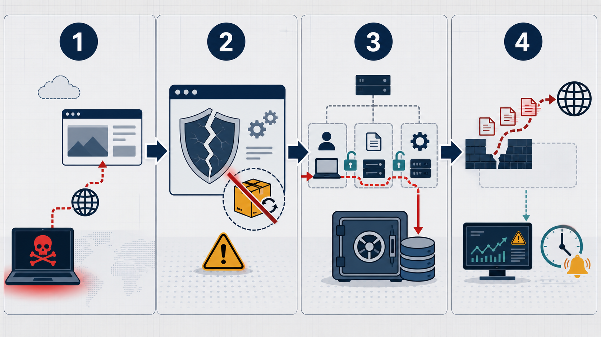
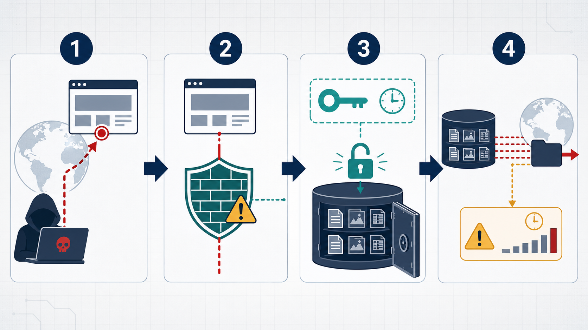
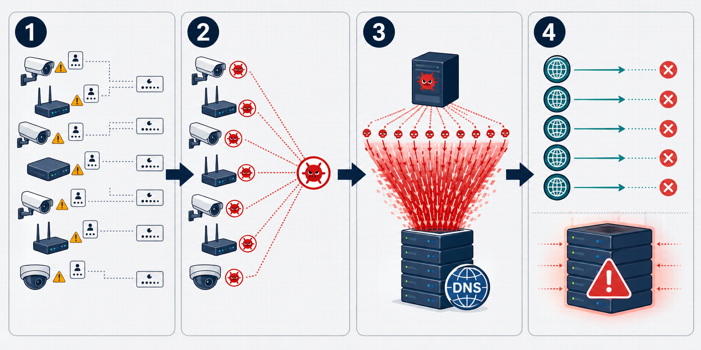

# 公開サーバー運用から学ぶ重要サイバー攻撃事例

この資料は、[公開サーバーセキュリティガイドライン](../PUBLIC_SERVER_SECURITY_GUIDELINE.md) に関連する過去の事例から、特に重要な3件を取り上げる。

図は公表資料を基にした教育用の概念図であり、実際のネットワーク構成や攻撃手順を完全に再現するものではない。攻撃方法の詳細ではなく、複数の管理不備がどのように被害へつながったかを理解することを目的とする。

## 1. Equifax 情報漏えい（2017年）

図の流れ:

1. 攻撃者がインターネット公開された消費者向けWebポータルを狙った
2. ポータルで使用されていた Apache Struts の既知の脆弱性に対するパッチが適用されていなかった
3. 侵入後、平文で保存された管理認証情報や不十分なネットワーク分離により、機密データへの到達範囲が広がった
4. 不審な通信の検知が遅れ、約1億4,700万人分の個人情報が影響を受けた

米国FTCは、脆弱性の通知後にパッチ適用指示が出ていたにもかかわらず、実施確認が不足していたと説明している。GAOは、資産の識別、検知、ネットワーク分離、データガバナンスを主要因として整理している。

公開サーバー運用への教訓:

- 脆弱性情報を受け取るだけでなく、対象資産の特定、適用、再スキャンまでを完了条件にする
- インターネット公開サーバーから機密データベースへ直接到達できないように分離する
- 管理認証情報を平文ファイルへ保存せず、シークレット管理機能を使用する
- TLS監視、アプリケーションログ、異常通信のアラートが実際に機能することを定期的に確認する

関連するガイドライン:

- [3. ネットワークとファイアウォール](../PUBLIC_SERVER_SECURITY_GUIDELINE.md#3-ネットワークとファイアウォール)
- [5. OS とソフトウェア](../PUBLIC_SERVER_SECURITY_GUIDELINE.md#5-os-とソフトウェア)
- [8. 秘密情報とデータ](../PUBLIC_SERVER_SECURITY_GUIDELINE.md#8-秘密情報とデータ)
- [9. ログ、監視、検知](../PUBLIC_SERVER_SECURITY_GUIDELINE.md#9-ログ監視検知)

出典:

- [Federal Trade Commission: Equifax to Pay $575 Million as Part of Settlement](https://www.ftc.gov/news-events/news/press-releases/2019/07/equifax-pay-575-million-part-settlement-ftc-cfpb-states-related-2017-data-breach)
- [U.S. Government Accountability Office: Data Protection - Actions Taken by Equifax and Federal Agencies](https://www.gao.gov/products/gao-18-559)

## 2. Capital One クラウド情報漏えい（2019年）

図の流れ:

1. 攻撃者がインターネット上のクラウド環境を探索し、公開アプリケーションを狙った
2. 米国司法省の公表資料によると、設定不備のあるWebアプリケーションファイアウォールを通じて侵入が行われた
3. 取得したクラウド認証情報に付与された権限を使い、アクセス可能なストレージからデータがコピーされた
4. 1億人を超える顧客・申込者の情報が影響を受け、外部からの通報を契機に調査と法執行機関への連絡が行われた

この事例は、WAFを配置していても、設定、クラウドIDの権限、ストレージへのアクセス制御が連鎖すると大きな被害につながることを示している。米国OCCは、クラウド移行前のリスク評価と、把握した不備の是正が不十分だったとして制裁金を科した。

公開サーバー運用への教訓:

- WAFを設置しただけで安全と判断せず、設定レビューと攻撃を想定したテストを行う
- サーバーやワークロードのクラウド権限を最小化し、不要なストレージを参照できないようにする
- SSRF対策やインスタンスメタデータへのアクセス制御を実施する
- 大量の一覧取得やデータ転送を検知し、クラウド監査ログをサーバー外で保全する
- クラウド事業者との責任分界を明確にし、自社側の設定を継続的に監査する

関連するガイドライン:

- [3. ネットワークとファイアウォール](../PUBLIC_SERVER_SECURITY_GUIDELINE.md#3-ネットワークとファイアウォール)
- [6. サービスとアプリケーション](../PUBLIC_SERVER_SECURITY_GUIDELINE.md#6-サービスとアプリケーション)
- [8. 秘密情報とデータ](../PUBLIC_SERVER_SECURITY_GUIDELINE.md#8-秘密情報とデータ)
- [9. ログ、監視、検知](../PUBLIC_SERVER_SECURITY_GUIDELINE.md#9-ログ監視検知)

出典:

- [U.S. Department of Justice: Former Seattle tech worker convicted of wire fraud and computer intrusions](https://www.justice.gov/usao-wdwa/pr/former-seattle-tech-worker-convicted-wire-fraud-and-computer-intrusions)
- [U.S. Department of Justice: Seattle Tech Worker Arrested for Data Theft Involving Large Financial Services Company](https://www.justice.gov/usao-wdwa/pr/seattle-tech-worker-arrested-data-theft-involving-large-financial-services-company)
- [Office of the Comptroller of the Currency: OCC Assesses $80 Million Civil Money Penalty Against Capital One](https://www.occ.treas.gov/news-issuances/news-releases/2020/nr-occ-2020-101.html)

## 3. MiraiボットネットによるDynへのDDoS（2016年）

図の流れ:

1. 初期設定の認証情報やハードコードされた認証情報を持つIoT機器がインターネット上で探索された
2. 多数のカメラやルーターなどがマルウェアに感染し、ボットネットへ組み込まれた
3. ボットネットからDNS事業者のDynへ大量の通信が集中した
4. DNSサービスが妨害され、依存していた多数のWebサイトが利用しにくい状態になった

Miraiは、1台ごとの弱い設定がインターネット規模で集約されると、第三者のサービスを停止させる攻撃基盤になることを示した。また、公開サービス側も大量通信をホスト単体で防ぐことは難しく、上流のDDoS対策が必要になる。

公開サーバー運用への教訓:

- 初期パスワードを直ちに変更し、不要な管理ポートとサービスを公開しない
- 外部公開資産を継続的に棚卸しし、意図しない待受ポートを検出する
- DDoS対策をホストファイアウォールだけに依存せず、CDN、クラウド事業者、レート制限を組み合わせる
- DNSを含む外部依存先を把握し、冗長化、監視、障害時の連絡経路を用意する
- 自組織の機器が攻撃に悪用されないよう、送信通信と異常なトラフィックも監視する

関連するガイドライン:

- [2. 基本原則](../PUBLIC_SERVER_SECURITY_GUIDELINE.md#2-基本原則)
- [3. ネットワークとファイアウォール](../PUBLIC_SERVER_SECURITY_GUIDELINE.md#3-ネットワークとファイアウォール)
- [4. 管理アクセスと認証](../PUBLIC_SERVER_SECURITY_GUIDELINE.md#4-管理アクセスと認証)
- [9. ログ、監視、検知](../PUBLIC_SERVER_SECURITY_GUIDELINE.md#9-ログ監視検知)

出典:

- [NIST SP 1800-15B: Securing Small-Business and Home Internet of Things Devices](https://www.nccoe.nist.gov/sites/default/files/legacy-files/iot-ddos-nist-sp1800-15b-preliminary-draft-v2.pdf)
- [CISA: NSTAC Report to the President on Internet and Communications Resilience](https://www.cisa.gov/sites/default/files/publications/NSTAC%20Report%20to%20the%20President%20on%20ICR%20FINAL%20%2810-12-17%29%20%281%29-%20508%20compliant_0.pdf)

## 4. 3事例に共通すること

| 共通点 | 必要な対策 |
| --- | --- |
| 公開資産や設定を正確に把握できていない | 資産台帳、公開ポート棚卸し、構成管理 |
| 1つの不備から被害範囲が拡大した | ネットワーク分離、最小権限、シークレット管理 |
| 防御製品の存在だけでは被害を防げなかった | 設定検証、継続監視、実効性テスト |
| 検知や是正の遅れが被害を大きくした | ログ集約、アラート、対応責任者、期限管理 |
| 単一の防御層では限界があった | ホスト、クラウド、アプリケーション、上流サービスによる多層防御 |

公開サーバーを安全に保つには、ファイアウォールを有効にして終わりではなく、公開範囲、更新、権限、監視、復旧を一つの運用として継続する必要がある。
